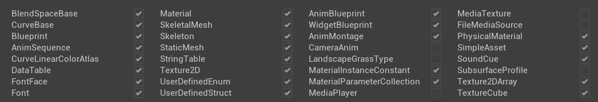

# Community Modkits
Since the engine is open source, it is not unreasonable to expect that modders can reverse a lot of things about the engine. Despite each version producing its own set of new challenges, the work of a handful of people has made a lot more possible. If you don’t want to provide any asset or header mod kits, it is highly likely that modders will produce one for you regardless of what you want. Of course, it depends on the conditions of modding, such as those settings covered previously, or engine version. 

## C++ Header Template Project
It is now trivially easy to create a full project of reflected C++ headers. It typically takes me under an hour to create and fix the errors for a C++ project for a new game. But that should not be any concern for you, as it was always simple to “dump” the C++ headers, but just not in this specific format.

Here’s an [example](https://github.com/DRG-Modding/FSD-Template) for Deep Rock Galactic, another [example](https://github.com/AstroColony-Modding/AC-Template) for Astro Colony, and the [source code](https://github.com/UE4SS-RE/RE-UE4SS) responsible for generating these.

## Full Asset Content Project
As you may know, it is not possible to just copy most cooked asset files directly back into the editor as they will cause crashes and you won’t be able to open them. There are a few exceptions where UE has code that “reconstructs” them – sound waves, string tables, data tables, static meshes (partially) and textures. Data assets are only reconstructed by the engine when they are duplicated in-place and then saved, and blueprint hierarchies can be obtained by creating a child BP of a cooked one.

But what if we could write code that took the parsed data from the cooked assets and generated raw assets in-editor? After all, information about every asset is stored in its cooked format, except for shaders, which is stored separately in the global shader cache file. And since we can generate the base C++ classes for these assets, we aren’t limited by that aspect. Modders have been reconstructing assets by hand from reading the same data for a long time, so why not automate it?

Over the last couple of years, myself and a few colleagues have been working on a tool that can do exactly this. At the time of writing, we can support all the checked asset types:

*List of supported asset types that can be reconstructed*

“Simple assets” are those with only hard coded values and references, such as data assets, sound classes, and some custom asset types. Any asset types we cannot parse, we produce them empty so that the other assets still get them as references.

We cannot fully reconstruct materials, since most of the data is stored in the global shader cache file, so we just populate with the data we can get, and the rest must be reconstructed by hand if a user wants to. Although it is possible, we cannot reconstruct any blueprint graph code currently, as it is extremely difficult.

Here’s an [example demo video](https://youtu.be/5fy35TDQMe0) for the project that I generated for Deep Rock Galactic. I have generated one for many games now, however I always ask for permission from the developers before distributing. I have been denied distributing for the game [Hydroneer](https://store.steampowered.com/app/1106840/Hydroneer/), which makes sense, because the entire game has just a small handful of C++ classes and the rest is blueprints which may be fully reconstructed at some point in the distant future.

This tool is [open source](https://github.com/LongerWarrior/UEAssetToolkitGenerator), and we have made extra sure that it does not break the UE EULA - but we won’t be able to stop people from using it to break EULAs for the games they generate assets for. That being said, the tools are not exactly easy to use, as it took me about 3 months just to generate the first batch of assets for DRG, which was still broken in many ways. 
