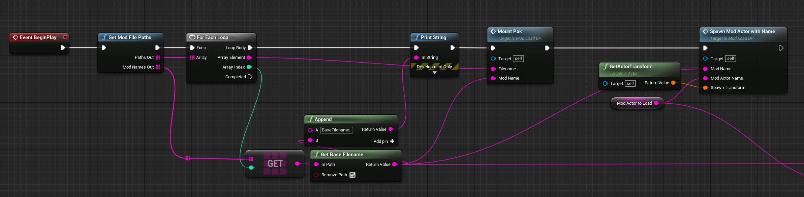
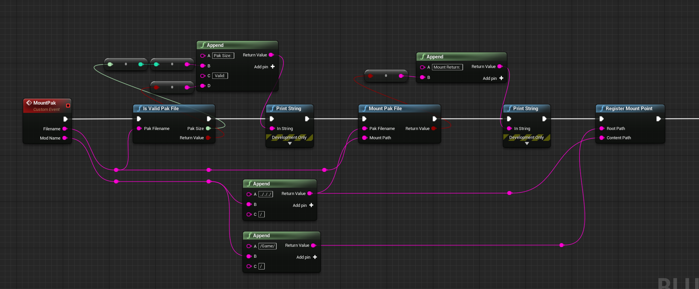
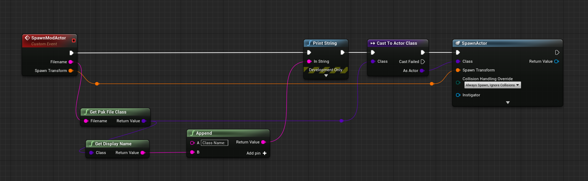

# Pak loader plugin
The first option that I suggest is using [this Pak loader plugin](https://www.unrealengine.com/marketplace/en-US/product/pak-loader-plugin) because it does pretty much everything you need to do for you. It only costs roughly $20 but the main reason you may not choose this option is due to it not being supported on your game’s engine version.

The plugin allows you to mount pak files from any file location. You can then spawn specific actors from within the pak file via a bit of blueprint code.

*Example code for the overall mount process*

*Example code for mounting a pak file*

*Example code for spawning a mod actor of a specified name*

The above images show all of the code responsible for loading mods in the game cyubeVR. The only part that had to be written in C++ was the function “Get Mod File Paths” which scans the Mods folder for the mod actors that it needs to load. 

So, in order to use this effectively, you should first establish what parameters you will require modders to use to load their blueprint mods.

Every time a new level is loaded, the game will need to reload the actors anyway, so this is a good opportunity to also reload any mod actors. To give finer control to modders, I suggest that you require a new actor per level to be provided. 

For example, if you have 2 levels – main menu and the world level, you can require modders to have a blueprint actor called “InitMenu” and an actor called “InitWorld” to load their mods. If a modder wanted their mod to only load in the world, then they only have to make and put code inside of their “InitWorld” actor. The “Init” part is just short for “Initialize” - keeping names short saves time and cuts back on potential headaches where spelling mistakes are made.

The downside is that if your game has a lot of levels, it would be annoying, so another option is to require one actor and provide modders with a C++ reflected blueprint function (so that modders do not need to download any files) that checks for the current level name and continues execution flow if it is a level that a modder wants.